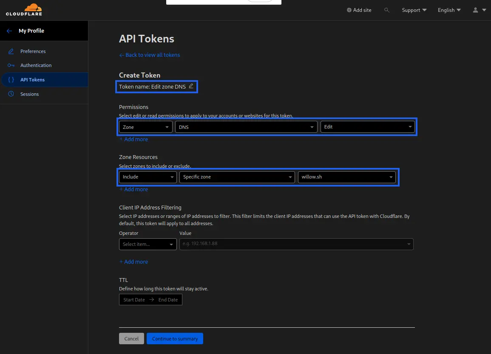
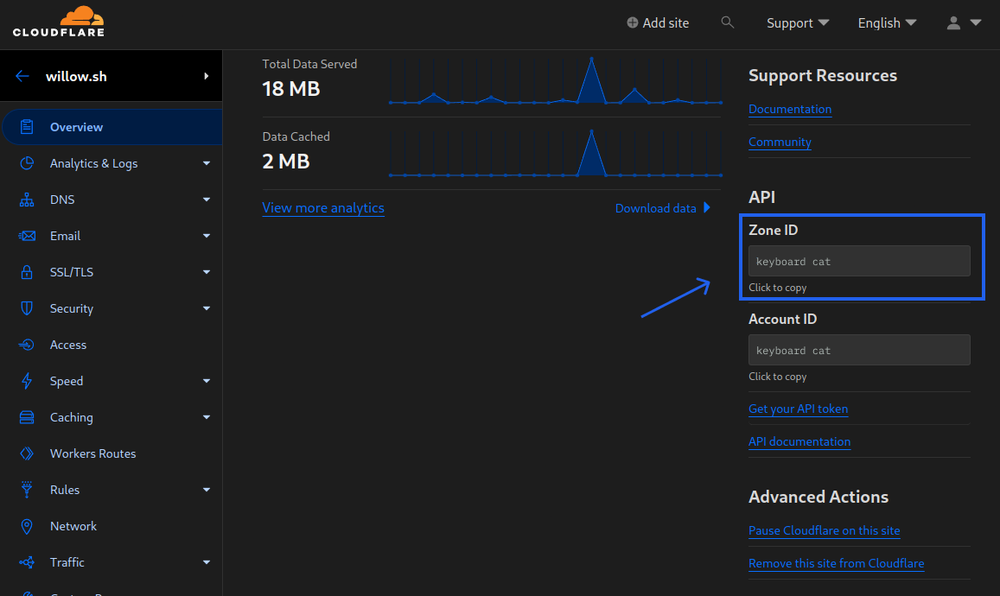

# Shire

Shire is a simple no fuss ddns client for Cloudflare. It allows you to update Cloudflare DNS record(s) with your current IP address.

## Installation

Grab your operating systems binary from the [Releases Tab](https://github.com/ghostdevv/shire/releases). You can then run this from terminal.

### Linux One Liner

If you're using linux you can use the following command to install it easily:

```bash
curl -sL -o shire https://github.com/ghostdevv/shire/releases/latest/download/shire-linux-amd64 \
  && chmod +x shire \
  && sudo mv -f shire /usr/local/bin \
  && sudo chown root:root /usr/local/bin/shire
```

### Running Regularly

You can run shire by invoking it directly `shire --help`. However it's really designed to run on a schedule, for example using a systemd timer or cron job.

#### Systemd Timer

The recommended way to run shire regularly is with a systemd timer, as it has the best observability options. You need to create both a `shire.service` and `shire.timer` file.

Create the following file in `/etc/systemd/system/shire.service`, replacing `<cloudflare-token>` and `<options>` with your values.

```ini
[Unit]
Description=Shire DDNS Client for Cloudflare
Wants=network-online.target
After=network-online.target

[Service]
Type=oneshot
Environment="CLOUDFLARE_API_TOKEN=<cloudflare-token>"
ExecStart=/usr/local/bin/shire <options>
```

Then create the following file in `/etc/systemd/system/shire.timer`.

```ini
[Unit]
Description=Shire DDNS Client for Cloudflare timer

[Timer]
OnCalendar=daily
Persistent=true

[Install]
WantedBy=timers.target
```

Finally run the following.

```bash
sudo systemctl daemon-reload
sudo systemctl enable shire.timer
```

The timer will run daily, but you can edit that to your liking. If you want to run it manually, you can run `sudo systemctl start shire.service`, and check the logs with `sudo systemctl status shire.service`/`journalctl -u shire.service`.

#### Cron

Replace `<options>` with your options.

```bash
0 0 * * * /bin/bash /usr/local/bin/shire <options>
```

## Usage

```bash
$ shire --help
Shire is a simple no fuss ddns client for Cloudflare

Usage: shire [OPTIONS] --zone-id <ZONE_ID> --key <KEY>

Options:
  -r, --records <RECORDS>          Comma seperated list of the record names to update
  -z, --zone-id <ZONE_ID>          The Cloudflare Zone Id for your domain
  -k, --key <KEY>                  Your Cloudflare API token [env: CLOUDFLARE_API_TOKEN=]
  -i, --ip-resolver <IP_RESOLVER>  The IP resolver url to use [default: https://ip.willow.sh]
  -h, --help                       Print help
  -V, --version                    Print version
```

> [!WARNING]
> If possible, please use the `CLOUDFLARE_API_TOKEN` environment variable instead of the `--key` flag.

### Example

If we wanted to update the record `test` we could do

```bash
shire --key CF_API_KEY --zone-id bab32631af40d574ag246741013k40z3 --records test
# or use the shorthand args
shire -k CF_API_KEY -z bab32631af40d574ag246741013k40z3 -r test
```

## Configuration

### Cloudflare API Key

You can generate an API Key by visiting the [Cloudflare Dashboard](https://dash.cloudflare.com/profile/api-tokens). Once you click the "Create Token" button, if available click the "Edit zone DNS" template, and then fill in similar to this:



Add as many zones as you are using with shire, or allow access to all zones.

### Zone Id

To get your Zone's Id visit your domain on the [Cloudflare Dashboard](https://dash.cloudflare.com?to=/:account/:zone). Click on the "Overview" tab, and scroll until you see the "API" on the right side of the page. You can then click to copy your Zone Id.



### Changing IP resolver

By default shire uses `https://ip.willow.sh`, a [cloudflare worker](https://workers.cloudflare.com/) run by me. You can pass your own URL that returns a text response with your ipv4 address:

```bash
$ shire --ip-resolver "https://ip.willow.sh"
```

I recommend you host your own [cloudflare worker](https://workers.cloudflare.com/) to make sure you can own & audit all the code you are running. However, you are more than welcome to use [mine](https://ip.willow.sh) if you like:

```js
export default {
	/** @param {Request} request */
	fetch(request) {
		return new Response(request.headers.get('cf-connecting-ip'), {
			headers: {
				'Access-Control-Allow-Origin': '*',
			},
		});
	},
};
```

```bash
$ curl https://ip.willow.sh
140.82.121.3
```
